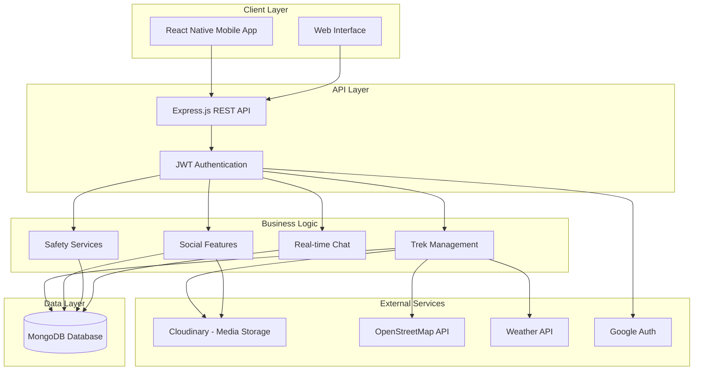
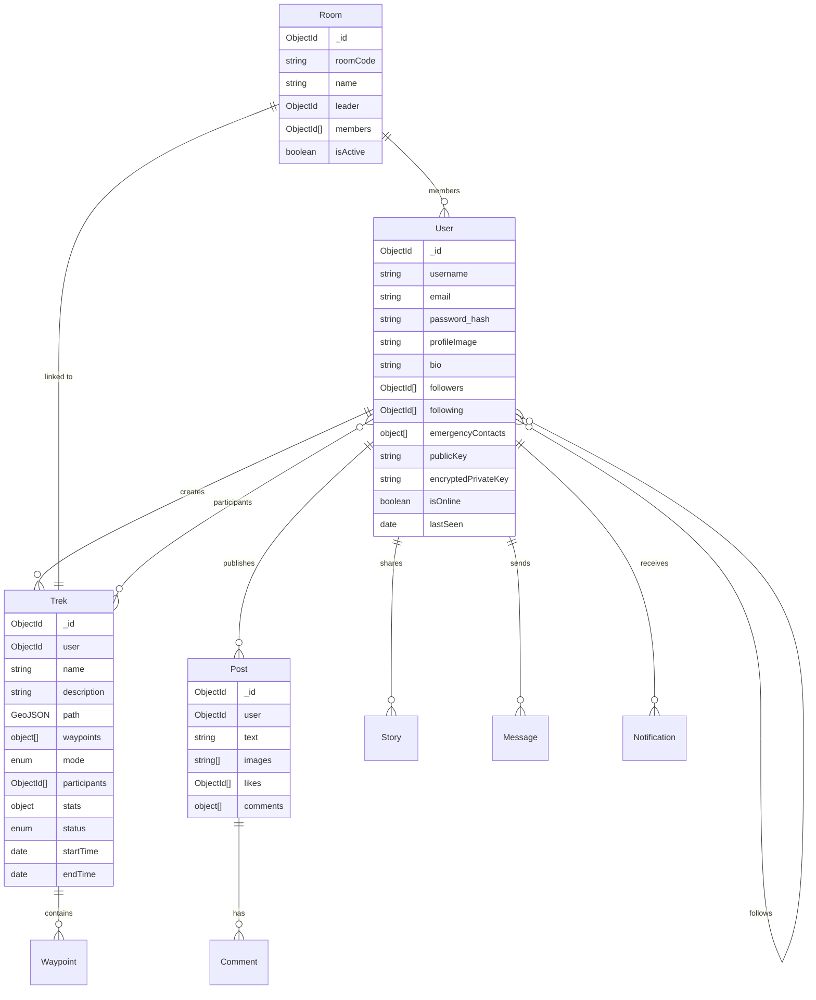
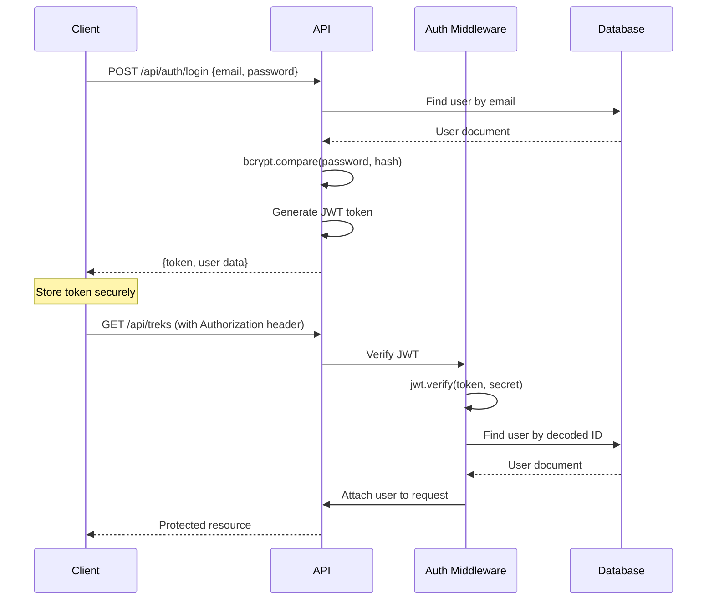

# HikerNet - Technical Presentation

## 📱 Executive Summary

**HikerNet** is a full-stack social networking application designed for hiking and outdoor enthusiasts. It combines real-time GPS tracking, social media features, safety mechanisms, and community engagement to create a comprehensive platform for trekkers.

---

## 🏗️ System Architecture

### High-Level Architecture



### Technology Stack

#### Frontend
- **Framework**: React Native (0.81.5) with Expo (~54.0)
- **Navigation**: Expo Router (file-based routing)
- **State Management**: React Context API
- **Mapping**: MapLibre for native, React Leaflet for web
- **UI Components**: Custom components with Expo libraries
- **Animations**: Lottie animations, React Native Reanimated
- **Key Libraries**:
  - `axios` - HTTP client
  - `expo-location` - GPS tracking
  - `expo-sensors` - Device motion sensors
  - `expo-secure-store` - Secure credential storage
  - `crypto-js` - End-to-end encryption

#### Backend
- **Runtime**: Node.js with ES Modules
- **Framework**: Express.js (v5.2.1)
- **Database**: MongoDB with Mongoose ODM
- **Authentication**: JWT with bcryptjs password hashing
- **Scheduled Tasks**: Cron jobs for automated processes
- **Key Libraries**:
  - `cors` - Cross-origin resource sharing
  - `google-auth-library` - OAuth integration
  - `osmtogeojson` - Map data conversion
  - `cloudinary` - Media management

---

## 📊 Data Model

### Core Entities



### Key Schema Details

#### User Model
- **Authentication**: Bcrypt hashed passwords with pre-save hooks
- **Social Graph**: Bidirectional follower/following relationships
- **Safety Features**: Emergency contacts with phone/email
- **Security**: E2EE support with public/private key pairs
- **Activity Tracking**: Online status and last seen timestamps
- **Trek Invitations**: Embedded invitation documents

#### Trek Model
- **Geospatial**: GeoJSON LineString for paths with 2dsphere indexing
- **Waypoints**: Embedded documents with coordinates, metadata, and images
- **Modes**: Solo or group trekking support
- **Statistics**: Distance, duration, elevation gain, average speed
- **Privacy**: Public/private trek visibility
- **Status**: Ongoing, completed, or paused states

---

## 🔐 Security Architecture

### Authentication Flow



### Security Features

1. **JWT Authentication**
   - Tokens signed with secret key
   - Token expiration management
   - Middleware-based route protection

2. **Password Security**
   - Bcrypt hashing (10 salt rounds)
   - Automatic hashing on user creation/update
   - Comparison method for login validation

3. **End-to-End Encryption (E2EE)**
   - Client-side key generation using NaCl
   - Public key exchange
   - Private key encryption with recovery password
   - PBKDF2 key derivation with salts

4. **OAuth Integration**
   - Google Sign-In support
   - Token verification via google-auth-library

5. **Data Protection**
   - User blocking functionality
   - Privacy settings for treks and posts
   - Secure credential storage (Expo SecureStore)

---

## 🚀 Core Features

### 1. Trek Management

**Real-time GPS Tracking**
- Continuous location updates using Expo Location
- Sensor integration for altitude and motion data
- Geospatial path recording with GeoJSON format
- 2dsphere MongoDB indexing for efficient queries

**Waypoint System**
- Custom markers with titles and descriptions
- Photo attachments at specific locations
- Timestamp and coordinate tracking
- Icon customization

**Trek Discovery**
- Automated discovery service using OSM API
- Nearby trek recommendations
- Geospatial queries for location-based results
- Cron job for periodic trail data updates

**Statistics Tracking**
- Distance calculation (meters)
- Duration monitoring (seconds)
- Elevation gain tracking
- Average speed computation (km/h)

### 2. Group Trekking

**Room Management**
- Unique 7-character room codes
- Leader-based room creation
- Member invitation system
- Join with code functionality
- "DUMMY" testing mode

**Collaborative Features**
- Multi-user trek participation
- Ready/Not Ready status system
- Minimum group size validation (2 members)
- Acceptance/rejection workflow
- Real-time member activity tracking

### 3. Social Network

**User Profiles**
- Profile customization (bio, location, image)
- Follower/following relationships
- Activity history
- Medical information storage
- Emergency contact management

**Content Sharing**
- **Posts**: Text, images, likes, comments
- **Stories**: 24-hour ephemeral content with views
- **Trek Feed**: Completed trek sharing
- Media upload via Cloudinary

**Real-time Chat**
- One-on-one messaging
- End-to-end encryption support
- Message status tracking
- Online/offline indicators
- Last seen timestamps

### 4. Safety Features

**Emergency Contacts**
- Multiple contact storage
- Name, phone, email fields
- Quick access during treks

**Location Sharing**
- Real-time location broadcasting
- Privacy controls
- Emergency location alerts

**Activity Tracking**
- Middleware-based user activity monitoring
- Automated online/offline status
- Last seen timestamp updates

### 5. Weather Integration

**Current Weather**
- Location-based weather fetching
- Temperature, conditions, humidity
- Wind speed and direction
- Weather analysis modal

**Weather Warnings**
- Severe weather alerts
- Trek safety recommendations
- Integration with trek planning

### 6. Notifications

**Push Notifications**
- Expo Push Token registration
- Follow notifications
- Like and comment notifications
- Trek invitation alerts
- Message notifications

**In-app Notifications**
- Notification center
- Read/unread status
- Action links
- Notification history

### 7. Adventure Discovery

**Trail Exploration**
- Browse nearby trails
- Filter by difficulty, distance, elevation
- Trail details with ratings
- Integration with trek creation

### 8. Leaderboards & Competition

**User Rankings**
- Total distance leaderboard
- Trek completion stats
- Top trekkers widget
- Upcoming treks preview

---

## 🔄 API Architecture

### RESTful Endpoints

#### Authentication (`/api/auth`)
```
POST   /signup           - User registration
POST   /login            - User authentication
POST   /google           - Google OAuth login
POST   /logout           - User logout
GET    /check            - Session validation
```

#### Treks (`/api/treks`)
```
POST   /start            - Create new trek
PATCH  /:id/end          - Complete trek
PATCH  /:id/pause        - Pause ongoing trek
POST   /:id/waypoint     - Add waypoint
POST   /:id/images       - Upload trek images
GET    /active           - Get active treks
GET    /:id              - Get trek details
DELETE /:id              - Delete trek
GET    /feed             - Get trek feed
```

#### Users (`/api/users`)
```
GET    /suggestion       - Get user suggestions
GET    /profile/:username - Get user profile
PUT    /update           - Update profile
POST   /:id/follow       - Follow user
POST   /:id/unfollow     - Unfollow user
GET    /followers/:username - Get followers
GET    /following/:username - Get following
POST   /block/:id        - Block user
POST   /unblock/:id      - Unblock user
```

#### Posts (`/api/posts`)
```
POST   /create           - Create post
GET    /all              - Get all posts
GET    /following        - Get following posts
POST   /like/:id         - Like post
POST   /comment/:id      - Comment on post
DELETE /:id              - Delete post
```

#### Stories (`/api/stories`)
```
POST   /create           - Create story
GET    /all              - Get all stories
POST   /view/:id         - Mark story viewed
DELETE /:id              - Delete story
```

#### Chat (`/api/chat`)
```
POST   /start            - Start conversation
GET    /conversations    - Get user conversations
GET    /:id/messages     - Get conversation messages
POST   /send             - Send message
POST   /keys/exchange    - Exchange encryption keys
POST   /keys/backup      - Backup private key
POST   /keys/restore     - Restore private key
```

#### Rooms (`/api/rooms`)
```
POST   /create           - Create trek room
POST   /join             - Join with code
POST   /:id/accept/:userId - Accept member
POST   /:id/reject/:userId - Reject member
POST   /:id/ready        - Toggle ready status
GET    /:id              - Get room details
POST   /:id/start-trek   - Start group trek
```

#### Additional Endpoints
- **Weather** (`/api/weather`) - Weather data
- **Safety** (`/api/safety`) - Emergency features
- **Notifications** (`/api/notifications`) - Notification management
- **Adventures** (`/api/adventures`) - Trail discovery
- **Location** (`/api/location`) - Location services

### Middleware Stack

1. **Authentication Middleware** ([auth.middleware.js](file:///home/jerii-4/projects/HikerNet_og/Backend/src/middleware/auth.middleware.js))
   - JWT token verification
   - User authentication for protected routes
   - Request user attachment

2. **Activity Tracker Middleware** ([activityTracker.js](file:///home/jerii-4/projects/HikerNet_og/Backend/src/middleware/activityTracker.js))
   - Automatic online status updates
   - Last seen timestamp management
   - User activity logging

3. **Express Middleware**
   - JSON body parser (50mb limit)
   - URL-encoded body parser
   - CORS configuration
   - Error handling

---

## 📱 Frontend Architecture

### File-based Routing (Expo Router)

```
app/
├── (auth)/              # Authentication screens
│   ├── login.jsx
│   └── signup.jsx
├── (tabs)/              # Main tab navigation
│   ├── home.jsx         # Feed & discover
│   ├── explore.jsx      # Map & trails
│   ├── create.jsx       # Create post/trek
│   ├── notifications.jsx
│   └── profile.jsx
├── trek/                # Trek screens
│   ├── active.jsx       # Live trek tracking
│   ├── [id].jsx         # Trek details
│   ├── create.jsx       # Create solo trek
│   ├── lobby.jsx        # Group trek lobby
│   └── room-join.jsx    # Join trek room
├── chat/
│   └── [id].jsx         # Chat conversation
├── post/
│   └── [id].jsx         # Post details
├── story/
│   ├── [id].jsx         # Story viewer
│   ├── create.jsx       # Story creation
│   └── camera.jsx       # Camera interface
├── safety/
│   ├── emergency.jsx    # Emergency interface
│   └── contacts.jsx     # Emergency contacts
├── settings/
│   ├── index.jsx        # Settings menu
│   └── restore-keys.jsx # Key recovery
├── edit-profile.jsx     # Profile editor
├── user-profile/
│   └── [username].jsx   # User profile view
└── _layout.jsx          # Root layout
```

### Component Architecture

**Reusable Components** ([/Frontend/components](file:///home/jerii-4/projects/HikerNet_og/Frontend/components))
- `PostItem.jsx` - Social post display
- `StoryBar.jsx` - Stories carousel
- `LiveTrekCard.jsx` - Active trek card
- `WeatherWidget.jsx` - Weather information
- `LeaderboardWidget.jsx` - User rankings
- `NativeMap.jsx` / `NativeMap.web.jsx` - Platform-specific maps
- `NotificationManager.jsx` - Push notification handling
- `UserListModal.jsx` - User selection modal
- `RequestsModal.jsx` - Trek invitation requests

### State Management

**Auth Context** ([AuthContext.js](file:///home/jerii-4/projects/HikerNet_og/Frontend/context/AuthContext.js))
- Global authentication state
- User session management
- Token storage and retrieval
- Login/logout operations
- Auto-login on app start

### Platform-Specific Code

**Native vs Web**
- Platform-specific map implementations
- Conditional imports for native modules
- Web fallbacks for native features
- Responsive design patterns

---

## 🔧 Backend Services

### Database Connection ([db.js](file:///home/jerii-4/projects/HikerNet_og/Backend/src/lib/db.js))
- MongoDB connection management
- Connection retry logic
- Environment-based configuration

### Cloudinary Integration ([cloudinary.js](file:///home/jerii-4/projects/HikerNet_og/Backend/src/lib/cloudinary.js))
- Media upload service
- Image transformation
- URL generation
- Automatic optimization

### Trek Discovery Service ([trekDiscoveryService.js](file:///home/jerii-4/projects/HikerNet_og/Backend/src/lib/trekDiscoveryService.js))
- Automated trail data fetching
- OSM (OpenStreetMap) integration
- GeoJSON conversion
- Trail database population

### Cron Jobs ([cron.js](file:///home/jerii-4/projects/HikerNet_og/Backend/src/lib/cron.js))
- Scheduled task execution
- Automated data cleanup
- Periodic service updates
- Story expiration (24-hour rule)

### Encryption Service ([encryption.js](file:///home/jerii-4/projects/HikerNet_og/Backend/src/lib/encryption.js))
- Key generation utilities
- Encryption/decryption helpers
- PBKDF2 implementation
- Recovery password handling

---

## 🗺️ Geospatial Features

### GeoJSON Integration

**Path Structure**
```json
{
  "type": "LineString",
  "coordinates": [
    [longitude, latitude],
    [longitude, latitude],
    ...
  ]
}
```

**MongoDB Geospatial Indexing**
```javascript
trekSchema.index({ path: '2dsphere' });
```

**Geospatial Queries**
- `$near` - Find nearby treks
- `$geoWithin` - Treks within area
- `$geoIntersects` - Path intersections
- Distance calculations

### Mapping Technologies

**Native Mobile**
- MapLibre React Native
- Custom tile servers
- Offline map support
- Real-time location overlay

**Web Interface**
- React Leaflet
- OpenStreetMap tiles
- Interactive markers
- Path visualization

---

## 📊 Performance Optimizations

### Frontend
1. **Code Splitting**
   - Route-based lazy loading
   - Component-level splitting
   - Dynamic imports

2. **Image Optimization**
   - Cloudinary transformations
   - Lazy loading
   - Progressive image loading
   - Expo Image component

3. **Caching**
   - API response caching
   - Secure store for credentials
   - In-memory state caching

4. **Animations**
   - React Native Reanimated (60 FPS)
   - Worklets for UI thread execution
   - Lottie for vector animations

### Backend
1. **Database Optimization**
   - Geospatial indexing
   - Compound indexes on frequent queries
   - Lean queries for read-only operations
   - Population limiting

2. **Request Optimization**
   - 50MB body size limit
   - CORS caching
   - Efficient route handlers

3. **Scheduled Tasks**
   - Cron-based background jobs
   - Off-peak processing
   - Batched operations

---

## 🧪 Testing & Development

### Test Files
- `test_trek.js` - Trek functionality
- `test_social.js` - Social features
- `test_features.js` - General features
- `test_google.js` - OAuth integration
- `test_osm.js` - Map services
- `test_discovery.js` - Trail discovery
- `test_waypoints.js` - Waypoint system
- `test_advanced.js` - Advanced features
- `test_db_debug.js` - Database debugging

### Development Workflow
1. **Backend**: `npm run dev` (nodemon auto-restart)
2. **Frontend**: `npm start` (Expo development server)
3. **Environment Configuration**: `.env` files for secrets
4. **Local IP Configuration**: Frontend requires local IP setup

---

## 🌐 Deployment Architecture

### Environment Variables

**Backend** ([.env](file:///home/jerii-4/projects/HikerNet_og/Backend/.env))
```env
PORT=3000
MONGO_URI=<mongodb_connection_string>
JWT_SECRET=<secret_key>
CLOUDINARY_CLOUD_NAME=<cloud_name>
CLOUDINARY_API_KEY=<api_key>
CLOUDINARY_API_SECRET=<api_secret>
GOOGLE_CLIENT_ID=<google_oauth_client_id>
```

**Frontend** ([.env](file:///home/jerii-4/projects/HikerNet_og/Frontend/.env))
```env
EXPO_PUBLIC_API_URL=http://<LOCAL_IP>:3000/api
```

### Deployment Considerations
1. **Backend**: Node.js hosting (Railway, Render, Heroku)
2. **Database**: MongoDB Atlas (cloud)
3. **Frontend**: 
   - Mobile: iOS App Store, Google Play
   - Web: Static hosting (Vercel, Netlify)
4. **Media**: Cloudinary CDN
5. **Maps**: OSM tile servers

---

## 🔮 Technical Highlights

### 1. Real-time Features
- Live GPS tracking with sub-meter accuracy
- Sensor fusion (GPS + Accelerometer + Barometer)
- WebSocket-ready chat architecture
- Online presence system

### 2. Security & Privacy
- End-to-end encryption for messages
- Client-side key generation
- Recovery password system
- JWT-based stateless authentication
- User blocking and privacy controls

### 3. Scalability
- Stateless API design
- Document-based data model
- Geospatial indexing for performance
- CDN for media delivery
- Horizontal scaling capability

### 4. Cross-platform
- Single codebase for iOS, Android, Web
- Platform-specific optimizations
- Native module integration
- Responsive design

### 5. Developer Experience
- ES Modules throughout
- File-based routing
- Hot reload in development
- Comprehensive test suite
- Modular architecture

---

## 📈 Future Enhancements

### Potential Features
1. **Real-time Trek Collaboration**
   - WebSocket integration
   - Live location sharing
   - Group chat during treks

2. **Offline Support**
   - Offline map caching
   - Local trek storage
   - Sync on reconnection

3. **Advanced Analytics**
   - Trek statistics dashboard
   - Personal achievement tracking
   - Comparative analytics

4. **AI Features**
   - Trail recommendation engine
   - Weather prediction
   - Safety risk assessment

5. **Gamification**
   - Achievements and badges
   - Challenges and competitions
   - Reward system

---

## 🎯 Key Differentiators

1. **Safety-First Design**: Emergency contacts, location sharing, weather integration
2. **Social Integration**: Not just tracking - sharing, connecting, competing
3. **Group Trek Support**: Collaborative outdoor experiences
4. **Privacy & Security**: E2EE messaging, privacy controls
5. **Comprehensive Features**: All-in-one platform for hikers
6. **Cross-platform**: Native mobile + web support
7. **Real-time Capabilities**: Live tracking, instant notifications
8. **Geospatial Excellence**: Advanced mapping and location features

---

## 📞 Technical Stack Summary

| Layer | Technology |
|-------|------------|
| **Frontend Framework** | React Native 0.81.5, Expo ~54.0 |
| **Backend Framework** | Express.js 5.2.1 |
| **Database** | MongoDB with Mongoose |
| **Authentication** | JWT, Google OAuth |
| **Maps** | MapLibre (native), Leaflet (web) |
| **Media Storage** | Cloudinary |
| **Real-time Location** | Expo Location API |
| **Encryption** | TweetNaCl, Crypto-JS |
| **Push Notifications** | Expo Push Notifications |
| **Geospatial Data** | GeoJSON, OSM |
| **Scheduled Tasks** | Cron |
| **Development** | Nodemon, Expo CLI |

---

## 🏁 Conclusion

HikerNet represents a sophisticated, modern approach to outdoor activity tracking and social networking. The architecture balances:

- **Performance**: Optimized database queries, efficient routing, CDN delivery
- **Security**: Multiple layers of authentication and encryption
- **Scalability**: Stateless design, geospatial indexing, modular structure
- **User Experience**: Real-time updates, cross-platform support, intuitive UI
- **Safety**: Emergency features, weather integration, location sharing

The application demonstrates proficiency in:
- Full-stack JavaScript development
- Mobile-first responsive design
- Real-time geospatial applications
- RESTful API architecture
- NoSQL database design
- Third-party service integration
- Security best practices
- Cross-platform development

This technical foundation provides a robust platform for current features while maintaining flexibility for future enhancements.
